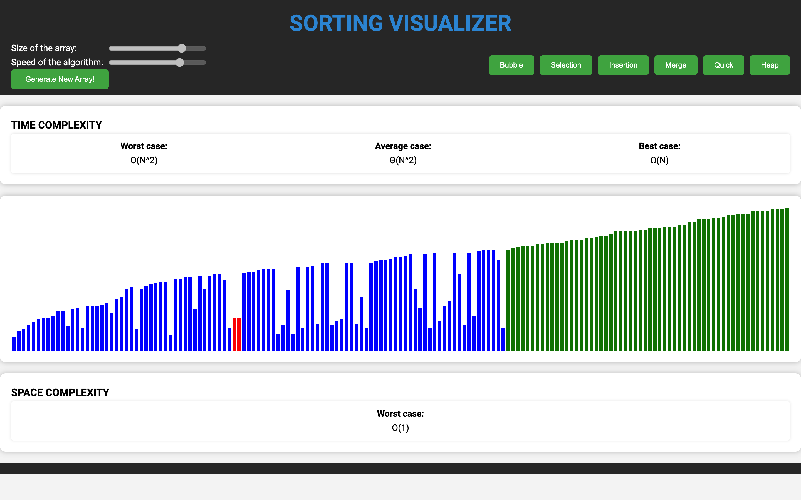

# OptiSort: Algorithm Sorting Visualization 

<!-- Table of Contents -->

Table of Contents

<ol>
    <li>
    <a href="#about-the-project">About The Project</a>
      <ul>
        <li>
            <a href="#built-with">Built With</a>
        </li>
      </ul>
    </li>
    <li>
        <a href="#implemented-sorting-algorithms">Implemented Sorting Algorithms</a>
    </li>
    <li>
        <a href="#features">Features</a>
    </li>
</ol>

## About the project

The Sorting Visualizer project is an interactive web application that provides a dynamic and visual representation of various sorting algorithms. Its primary goal is to help users understand how different sorting algorithms work by demonstrating the step-by-step process of rearranging elements within an array. Through a user-friendly interface, this project allows users to generate arrays of different sizes and visualize the sorting algorithms in action, gaining insights into their time and space complexities.

### Built With

-   ![JavaScript][JavaScript]
-   ![HTML][HTML]
-   ![CSS][CSS]

## Implemented Sorting Algorithms:

1. ![Bubble sort][bubble-sort]
2. ![Selection sort][selection-sort]
3. ![Insertion sort][insertion-sort]
4. ![Merge sort][merge-sort]
5. ![Quick sort][quick-sort]
6. ![Heap sort][heap-sort]

## Features:

1. Array Generation: Users can generate arrays of varying sizes, providing a hands-on experience with different input data.

2. Algorithm Selection: Users can choose from a selection of popular sorting algorithms such as Bubble Sort, Selection Sort, Insertion Sort, Merge Sort, Quick Sort, and Heap Sort.

3. Real-time Visualization: The sorting process is visually represented on the screen, showing how elements move and swap positions during each iteration of the algorithm.

4. Time and Space Complexity: The project provides insights into the time and space complexities of each sorting algorithm, helping users understand their efficiency in different scenarios.

## Screenshots

<!-- LINKS  -->

[JavaScript]: https://img.shields.io/badge/JavaScript-F7DF1E?style=for-the-badge&logo=javascript&logoColor=black
[HTML]: https://img.shields.io/badge/HTML5-E34F26?style=for-the-badge&logo=html5&logoColor=white
[CSS]: https://img.shields.io/badge/CSS-239120?&style=for-the-badge&logo=css3&logoColor=white
[bubble-sort]: https://img.shields.io/badge/Bubble%20Sort-FFA500?style=for-the-badge&logoColor=white
[selection-sort]: https://img.shields.io/badge/Selection%20Sort-FFA500?style=for-the-badge&logoColor=white
[insertion-sort]: https://img.shields.io/badge/Insertion%20Sort-FFA500?style=for-the-badge&logoColor=white
[merge-sort]: https://img.shields.io/badge/Merge%20Sort-FFA500?style=for-the-badge&logoColor=white
[quick-sort]: https://img.shields.io/badge/Quick%20Sort-FFA500?style=for-the-badge&logoColor=white
[heap-sort]: https://img.shields.io/badge/Heap%20Sort-FFA500?style=for-the-badge&logoColor=white
